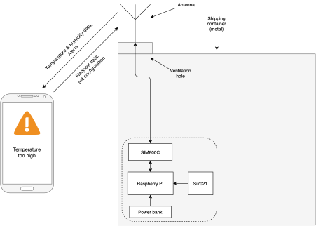
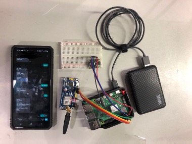
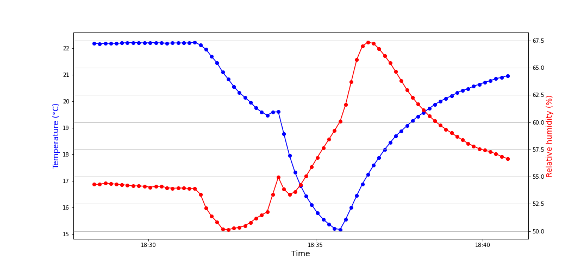
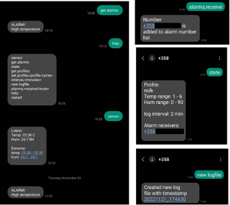

# ELEC-E8742 - Translational Engineering Forum
# Project: Fresh on the road

## Description

*This project was a part of a university course and it was conducted with a team of four people.*

Four billion metric tons of food are produced annually of which 14 % is lost between harvesting and retail or before reaching the consumer. Food transportation is a critical link between food production and food consumption. It causes a significant risk to the preservation of food because conditions are not as well controlled as in warehouse or shop buildings. If the products are not delivered in certain conditions, it might lead to food waste, business disruption, lawsuits, and customer complaints.

To keep conditions within certain values, it is important to be able to monitor conditions and warn the responsible person when the conditions are not within the accepted values. In cases where spoilage of the food cannot be prevented, it is important to know when it has happened. With this information, the same thing can be prevented from happening again and later process steps are not done in vain.

The idea of this project is to develop a proof of concept for a solution, which can monitor the temperature and humidity conditions inside shipping containers and communicate with the outside world via GSM technology.

The outcome of this project can be utilized to develop a device that has enough reliability for production on a large scale.

## System design

## Prototype

## Preview

)
